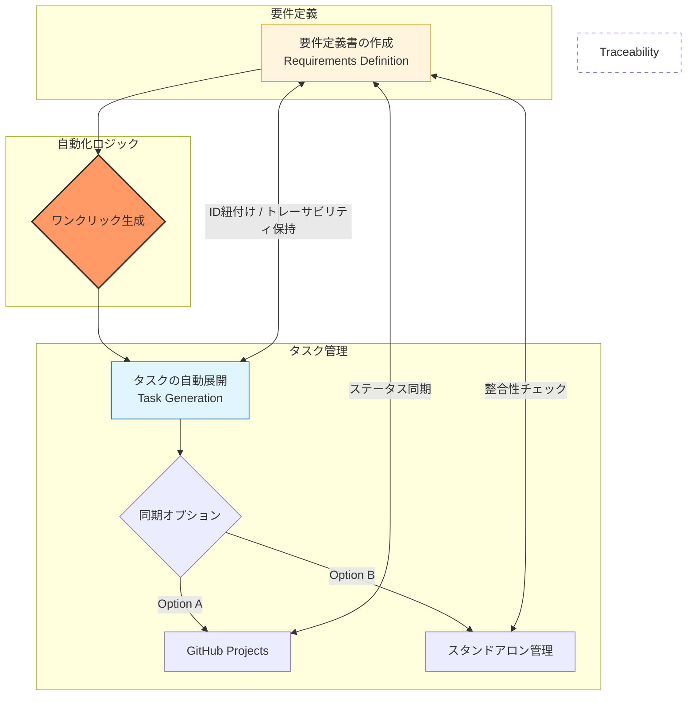

# DOC-01 ビジネスコンセプト確認ドキュメント

| 項目 | 内容 |
|------|------|
| 書類ID | DOC-01 |
| IPA分類 | DD.1.1 |
| プロジェクト名 | Reqflow |
| 作成日 | 2026-03-01 |
| 作成者 | Saku0512 |
| ステータス | Draft |

---

## 1. 解決する問題

ソフトウェア開発チームにおいて、PdMが要件定義書を作成してからエンジニアへタスクを指示するまでのプロセスで、以下の問題が発生している。

- 要件定義書（Notion等）とタスク（GitHub Projects等）が別ツールで管理されており、要件とタスクのトレーサビリティが失われる
- 要件からタスクへの変換が手動であるため、抜け漏れが生じる
- 承認フローが属人的であり、どの要件がいつ誰に承認されたか記録されない
- 未決定事項が要件定義書の中に埋もれ、期限切れのまま放置される

---

## 2. ビジネスゴール

| ゴール | 達成基準 |
|--------|----------|
| 要件とタスクを一元管理し、トレーサビリティを保つ | 全タスクに要件IDが紐付いた状態を維持する |
| 要件→タスク変換の手動作業をなくす | 手動起票ゼロ（GitHub連携使用時）またはワンクリックでのタスク生成 |
| 未決定事項を確実に管理する | 期限切れ未決定事項をゼロに近づける |

---

## 3. ターゲットユーザー

**主ユーザー：PdM（プロダクトマネージャー）**

プロダクトの価値最大化を担い、要件定義書を作成・管理する。スクラムのPO（プロダクトオーナー）に近い役割。

**サブユーザー：TL / PL / エンジニア**

TLは技術的妥当性のレビュー、PLはチーム内進捗の確認、エンジニアはタスクの参照に利用する。

---

## 4. ソリューションコンセプト

このフローをひとつのデスクトップアプリ（Wails + Go + Svelte）で完結させる。

**GitHub連携はオプション**とし、リポジトリアクセス権が限られる環境でもスタンドアロンで全中核機能を利用できる。

---

## 5. 既存ツールとの差別化

| ツール | 強み | 弱み（Reqflowが補う点） |
|--------|------|------------------------|
| Notion / Confluence | 文書管理 | タスク管理・承認フローが弱い |
| Jira / GitHub Projects | タスク管理 | 要件定義書との紐付けがない |
| Reqflow | 両方を一元管理・トレーサビリティ | — |