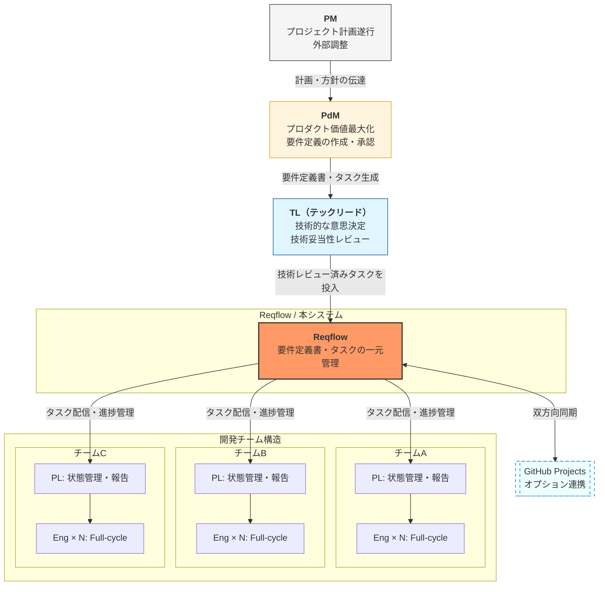

# DOC-02/03 ステークホルダ関連図・一覧

| 項目 | 内容 |
|------|------|
| 書類ID | DOC-02 / DOC-03 |
| IPA分類 | DD.2.1 / DD.2.2 |
| プロジェクト名 | Reqflow |
| 作成日 | 2026-03-01 |
| 作成者 | Saku0512 |
| ステータス | Draft |

---

## 1. ステークホルダ関連図（DD.2.1）

---

## 2. ステークホルダ一覧（DD.2.2）

| # | 役割 | 説明 | Reqflowへの関与度 | 主な利用機能 | 要件定義への参加 |
|---|------|------|-------------------|--------------|-----------------|
| 1 | **PdM** | プロダクトの価値・売上最大化に集中。スクラムのPOに近い | ◎ 主ユーザー | 要件定義書エディタ・タスク生成・未決定事項管理 | 作成・承認 |
| 2 | **PM** | プロジェクト計画の遂行と外部（クライアント・経営層等）との調整を担う | △ 参照ユーザー | ダッシュボード（進捗確認） | レビュー・承認（上位） |
| 3 | **TL** | 技術的な意思決定・アーキテクチャ設計を担う | ○ サブユーザー | 要件定義書レビュー・タスクアサイン | 技術的妥当性レビュー |
| 4 | **PL** | チームごとに1名存在し、チーム内部の状態管理を担いPMへ報告する。1プロジェクトに複数チームがある場合、PLも複数人になる | ○ サブユーザー | タスクボード・進捗ダッシュボード（自チーム分） | 進捗確認・報告 |
| 5 | **Full-cycleエンジニア** | 設計〜実装〜テストを一貫して担当する | △ 参照ユーザー | タスク詳細・要件定義書参照 | なし（読み取りのみ） |
| 6 | **開発者（本アプリ）** | Saku0512。設計・開発・保守を担当 | ◎ 開発者 | 全機能 | 全工程 |

### 凡例
- ◎：主要な利用者・深く関与
- ○：定期的に利用・関与
- △：必要時のみ参照

---

## 3. ステークホルダへの対応方針

| 役割 | 対応方針 |
|------|----------|
| PdM | 最優先でニーズを満たす。UXの中心として設計する |
| PM | ダッシュボードで進捗をひと目で確認できるようにする |
| TL | 要件セクションへのコメント・レビュー機能を提供する（v0.3以降） |
| PL | タスクボードを直感的に操作できるUIにする |
| エンジニア | 要件定義書・タスク詳細を読み取り専用で参照できるようにする |