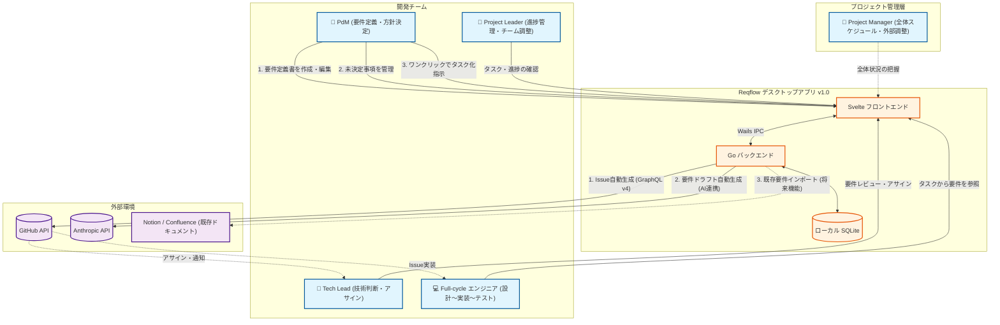

# DOC-04 リッチピクチャ

| 項目 | 内容 |
|------|------|
| 書類ID | DOC-04 |
| IPA分類 | DD.2.3 |
| プロジェクト名 | Reqflow |
| 作成日 | 2026-03-01 |
| 作成者 | Saku0512 |
| ステータス | Draft |

---

## 1. 概要

本ドキュメントでは、Reqflowを取り巻くステークホルダと各種システム・環境との関係性を非形式的な図（リッチピクチャ）として表現します。複雑な関係性を直感的に理解し、システム境界や外部とのインタラクションの全体像を把握することを目的としています。v1.0での追加要素（AIドラフト生成等）を含んでいます。

## 2. リッチピクチャ（関係概念図）

## 3. 図の解説

*   **PdM（プロダクトマネージャー）** はReqflowの主たるユーザーであり、要件の作成、未決定事項の管理、およびタスク（Issue）の自動生成指示をReqflowを通じて行います。
*   **Reqflow** はローカル（デスクトップ）で動作するアプリケーションであり、コアロジックを担うGoバックエンドとローカルデータベース（SQLite）によって構成されています。これにより、オフライン環境下（GitHub連携機能を除く）でも機密性の高い要件定義書の作成が可能です。
*   **外部APIの活用（v1.0の拡張）**
    *   **GitHub API**: 要件定義書から直接GitHub Issueを生成・同期します。これにより、エンジニア（Dev）やテックリード（TL）がGitHub上でタスクを確認・対応する一連のフローがシームレスに繋がります。
    *   **Anthropic API**: v1.0において、PdMが要件定義を行う際の負荷を軽減するため、AIによるドラフト自動生成機能のために利用されます。
    *   **Notion / Confluence**: 既存資産をReqflowに取り込むための移行元システムとして想定されています。

この図を通じて、要件が「Reqflow（上流）」から「GitHub（下流・実装タスク）」へと一方向に、かつトレーサビリティを保ったまま流れていく全体像を示しています。
