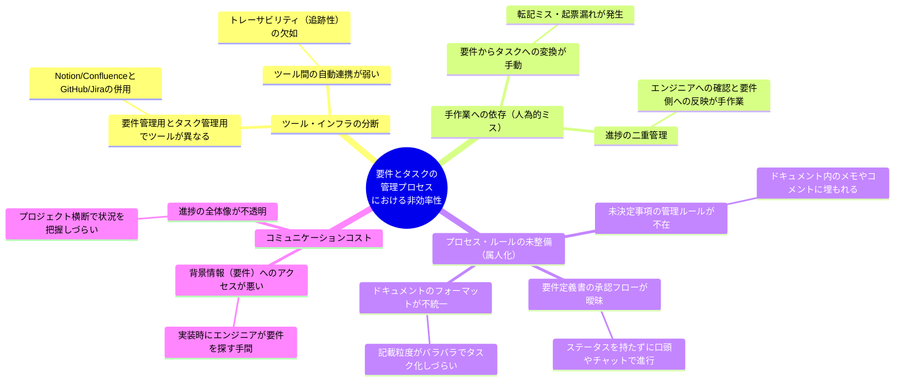

# DOC-06 問題原因分析図

| 項目 | 内容 |
|------|------|
| 書類ID | DOC-06 |
| IPA分類 | DD.3.2 |
| プロジェクト名 | Reqflow |
| 作成日 | 2026-03-01 |
| 作成者 | Saku0512 |
| ステータス | Draft |

---

## 1. 概要

本ドキュメントでは、現状（As-Is）の要件定義からタスク管理に至る業務プロセスにおいて発生している主要な問題に対して、その根本原因を特性要因図（フィッシュボーン図相当）の形で分析し、体系的に整理します。これにより、Reqflowによって解決すべき核心的な課題を明確にします。

## 2. 問題原因分析ツリー

## 3. 分析結果とReqflowでの解決方針

上記の要因分析に基づく各根本原因と、それをReqflow（v1.0を含む）でどのように解決するかを示します。

| 根本原因カテゴリ | 具体的な原因 | 発生している問題（DOC-05参照） | Reqflowにおける解決アプローチ |
| :--- | :--- | :--- | :--- |
| **ツールの分断** | 要件管理とタスク管理のツールが物理的に分かれている（NotionとGitHubなど）。 | P-01 (トレーサビリティ欠如) P-05 (ツール間行き来) | Reqflowという単一の統合インターフェース内で、要件定義とタスク進捗（タスクボード）をシームレスに扱う設計とする。 |
| **手作業への依存** | 要件定義書を読みながら、人間が手動でタスクを分割し、Issueとして起票している。 | P-02 (タスク変換漏れ) P-06 (要件とIssueの乖離) | 【F-09】要件定義の単位（機能等）から、自動的にGitHub Issueを生成し、要件IDを付与して双方向のリンクをシステム的に担保する。 |
| **属人的なプロセス** | 「未決定事項」をドキュメントの片隅に書く運用となっており、期限管理やアラートの仕組みがない。 | P-04 (未決定事項の放置) | 【F-07, F-15】未決定事項（Open Issue）を独立したエンティティとして状態と期限を持たせ、期限切れに対してシステム的に警告（アラート）を発する仕組みを導入。 |
| **属人的なプロセス** | 要件定義の各機能セクションに対して、「下書き」「レビュー中」「承認済」といったステータス管理機能がない。 | P-03 (承認状態が不明) | 【F-05】セクション単位での明示的なステータス（Draft/Review/Approved）を持たせ、承認プロセスを可視化・管理する。 |
| **作成負荷**(v1.0課題) | ゼロから構造化された要件定義書を記述するコスト（認知負荷）が高い。 | (新規) 要件作成の遅延 | 【F-14】(v1.0新機能) Anthropic API等のAIを用いて、ヒアリングメモ等から要件のドラフト（下書き）プロセスをアシストする。 |
