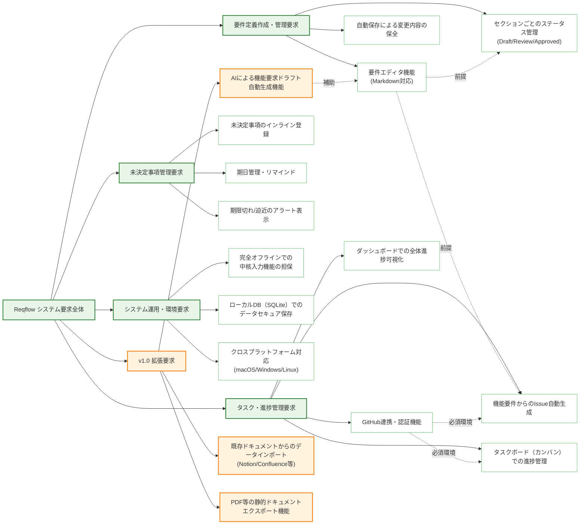

# DOC-07 要求構造図

| 項目 | 内容 |
|------|------|
| 書類ID | DOC-07 |
| IPA分類 | DD.3.3 |
| プロジェクト名 | Reqflow |
| 作成日 | 2026-03-01 |
| 作成者 | Saku0512 |
| ステータス | Draft |

---

## 1. 概要

本ドキュメントでは、Reqflowに対する主要なシステム要求（要件）と、それらを構成するサブ要求間の依存関係や包含関係を階層構造で図示します。本図は、v1.0フェーズでの追加要素（AIドラフト生成、データ移行機能など）を含め、システム機能の全体スコープの整理および実装の優先順位付けに役立てます。

## 2. 要求構造図

## 3. 構造の解説

### 要件定義作成・管理要求
Reqflowの中核となる機能群です。Markdownによるリッチなテキスト編集体験（要求エディタ）と、セクション（要件項目）単位での精緻なステータス管理を保証します。これにより、承認プロセスが属人的になることを防ぎます。

### タスク・進捗管理要求
「トレーサビリティの確保」と「手作業の排除」を実現する機能群です。ユーザーはGitHub連携を設定することで、要件エディタで作成した項目を直接Issue化し、Reqflowのカンバン（タスクボード）を通じて進捗状況を追跡できます。GitHubの認証はこの機能利用の前提条件となります。

### 未決定事項管理要求
要件策定時に発生する保留事項を埋もれさせないための機能群です。期日管理に特化しており、要件エディタ上で付随的に発生する課題を期限付きで管理・アラート通知します。

### システム運用・環境要求
非機能要件に由来する要求です。デスクトップアプリ（Wailsベース）としての独立性（オフライン動作の担保）と、セキュアなローカル環境（SQLite）でのデータ保持を定義します。

### v1.0 拡張要求（新規）
バージョン1.0に向けて追加される高度な機能要求です。
*   **AIドラフト生成**: Anthropic API等のLLMを活用し、ユーザーの要件定義の初動負荷を軽減します（要求エディタの補助機能）。
*   **インポート/エクスポート**: 他のツール（Notion等）で作成された既存の要件資産をReqflowに取り込む機能や、Reqflowで完成した要件定義書をPDF等で出力する機能を提供し、業務プロセスにおける他のシステムとの相互運用性を高めます。
