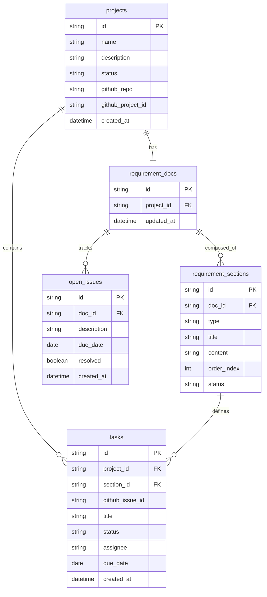

# DOC-09/10 管理対象分類図・概念データモデル（ER図）

| 項目 | 内容 |
|------|------|
| 書類ID | DOC-09 / DOC-10 |
| IPA分類 | DD.4.1 / DD.4.2 |
| プロジェクト名 | Reqflow |
| 作成日 | 2026-03-01 |
| 作成者 | Saku0512 |
| ステータス | Draft |

---

## 1. 管理対象分類図（DD.4.1）

Reqflowが扱うデータを大分類・中分類で整理する。

```
Reqflow管理対象データ
│
├── プロジェクト管理
│   └── プロジェクト（名称・説明・ステータス・GitHub連携情報）
│
├── 要件定義書管理
│   ├── 要件定義書（プロジェクトに1:1で紐付く）
│   ├── 要件セクション（業務要件 / 機能要件 / 非機能要件 / 制約条件）
│   └── 未決定事項（期限・解決状況）
│
├── タスク管理
│   └── タスク（ステータス・担当者・期限・要件セクションへの参照）
│
└── 連携情報（オプション）
    ├── GitHub PAT（OS Keychainで管理・DBには保存しない）
    ├── GitHubリポジトリ情報
    └── GitHub Projects情報
```

---

## 2. 概念データモデル（ER図）（DD.4.2）




### エンティティ間のカーディナリティ

| 関係 | カーディナリティ | 説明 |
|------|-----------------|------|
| projects → requirement_docs | 1:1 | プロジェクト1つに要件定義書1つ |
| requirement_docs → requirement_sections | 1:N | 要件定義書は複数セクションを持つ |
| requirement_docs → open_issues | 1:N | 要件定義書は複数の未決定事項を持つ |
| projects → tasks | 1:N | プロジェクトは複数タスクを持つ |
| requirement_sections → tasks | 1:N（nullable） | セクションからタスクを生成（トレーサビリティ） |

### 設計上の重要ポイント

- `tasks.section_id` が NULL許容なのは、GitHub連携なしで手動作成したタスクにも対応するため
- `github_*` 系カラムはすべてNULL許容。GitHub未連携でも動作する
- GitHub PATはDBに保存せず、OS Keychainのみで管理する