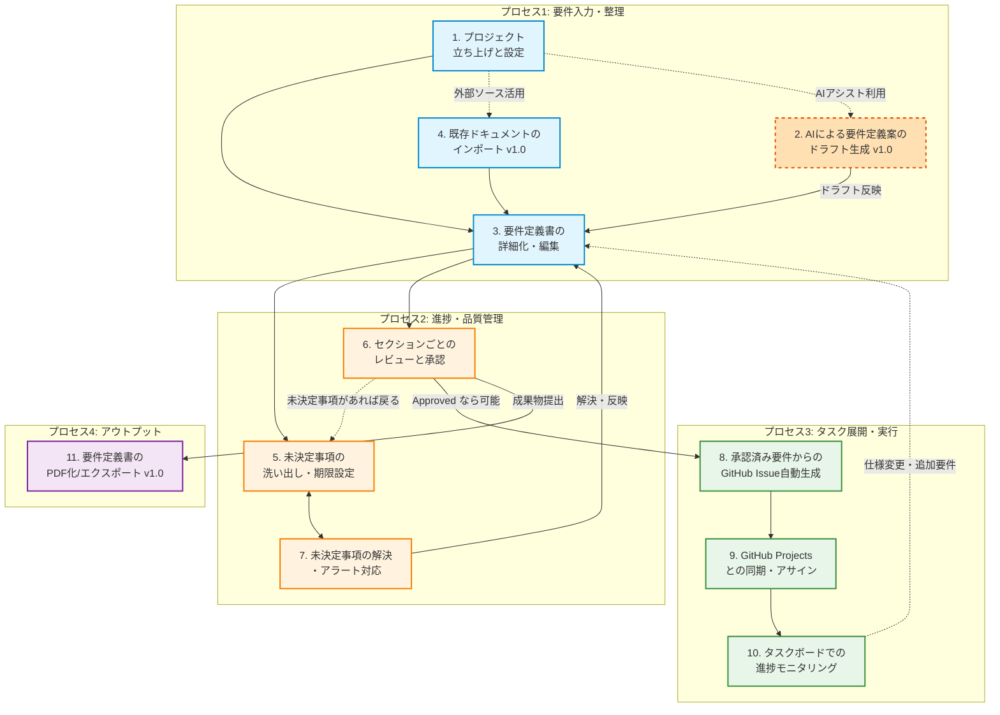

# DOC-11 ビジネスプロセス関連図

| 項目 | 内容 |
|------|------|
| 書類ID | DOC-11 |
| IPA分類 | DD.5.1 |
| プロジェクト名 | Reqflow |
| 作成日 | 2026-03-01 |
| 作成者 | Saku0512 |
| ステータス | Draft |

---

## 1. 概要

本ドキュメントでは、要件定義からタスク化、そして進捗管理に至る一連のビジネスプロセス（業務プロセス）において、各プロセスがどのように関連し、相互に依存しているかを可視化します。これにより、各工程でReqflowの中核機能（およびv1.0で追加されるAI機能等）が業務改善にどのように寄与しているかを俯瞰することができます。

## 2. ビジネスプロセス関連図

## 3. プロセス解説

一連のビジネスプロセスは大きく4つの段階に分かれます。

### プロセス1: 要件入力・整理
プロジェクトの開始点です。ゼロから手作業で要件を入力する（P3）だけでなく、v1.0からはAIを活用した自動ドラフト生成（P2）や、既存資産（Notion等）のインポート（P4）を経由することで、要件定義書作成における初動の負荷を劇的に引き下げます。

### プロセス2: 進捗・品質管理
入力された要件の品質を高め、タスク化可能な状態（承認済み）へ引き上げるプロセスです。
要件のうち仕様が固まっていない部分は「未決定事項」として抽出し、期限を設定します（P5）。未決定事項が放置されないようアラートシステム（P7）を組み込みます。これらが解決されたセクションから順次レビューおよび承認（P6）を行っていきます。

### プロセス3: タスク展開・実行
承認された要件（Approved）に基づいて、実際に開発を行うためのタスク化プロセスです。
PdMのアクションを起点として、GitHub Issueを自動で生成し（P8）、GitHubの実構成（Projects等）と同期させます（P9）。これにより、PdMやプロジェクトマネージャーはReqflow内のタスクボードを閲覧するだけで、常に最新のエンジニア実装状況（P10）を把握することができ、手動でのタスク起票・二重管理が不要になります。

### プロセス4: アウトプット
プロジェクトの節目やステークホルダへの報告用に、承認済みの要件定義情報を整えられたPDFファイル等に出力（P11）する、v1.0で追加・拡充される工程です。
