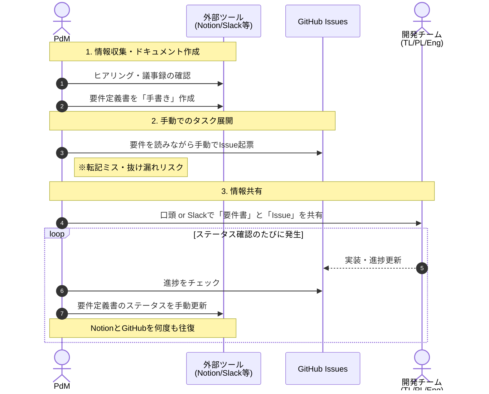
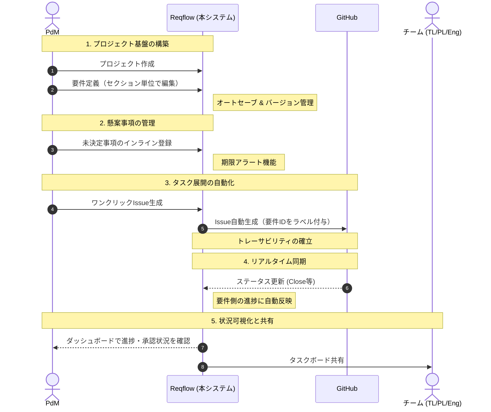
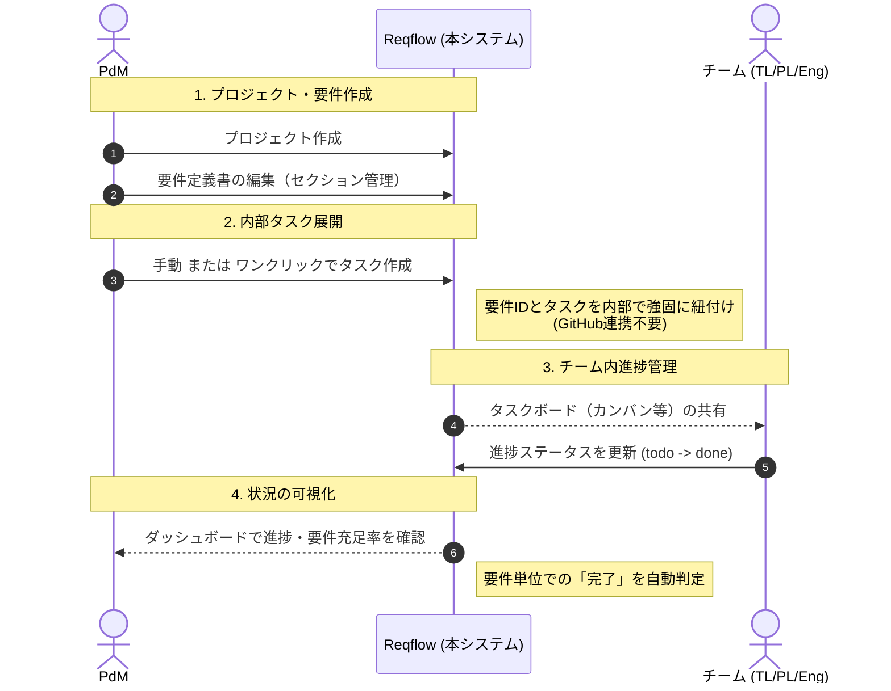

# DOC-12/13/14 業務機能構成表・業務フロー（As-Is / To-Be）

| 項目 | 内容 |
|------|------|
| 書類ID | DOC-12 / DOC-13 / DOC-14 |
| IPA分類 | DD.5.2 / DD.5.3 / DD.5.4 |
| プロジェクト名 | Reqflow |
| 作成日 | 2026-03-01 |
| 作成者 | Saku0512 |
| ステータス | Draft |

---

## 1. 業務機能構成表（DD.5.2）

Reqflowが支援する業務を階層で整理する。

```
Reqflow支援業務
│
├── 1. プロジェクト管理業務
│   ├── 1.1 プロジェクト作成
│   ├── 1.2 プロジェクト一覧確認
│   └── 1.3 プロジェクト設定変更
│
├── 2. 要件定義書作成・管理業務
│   ├── 2.1 要件定義書の新規作成（テンプレート選択）
│   ├── 2.2 セクションの編集（Markdown）
│   ├── 2.3 セクションのステータス管理（Draft→Review→Approved）
│   ├── 2.4 セクションの追加・並び替え・削除
│   └── 2.5 未決定事項の管理
│       ├── 2.5.1 未決定事項の登録（期限付き）
│       └── 2.5.2 未決定事項の解決済みマーク
│
├── 3. タスク管理業務
│   ├── 3.1 タスクの作成（要件からの生成 or 手動作成）
│   ├── 3.2 タスクへの担当者アサイン
│   ├── 3.3 タスクのステータス更新（todo→in_progress→done）
│   └── 3.4 進捗確認（ダッシュボード・カンバンボード）
│
└── 4. GitHub連携業務（オプション）
    ├── 4.1 GitHub PAT設定・認証
    ├── 4.2 要件からGitHub Issue自動生成
    └── 4.3 GitHub Projectsとのステータス同期
```

---

## 2. 業務フロー As-Is（現状）（DD.5.3）

### メインフロー：要件定義〜タスク管理



**課題ポイント：**
- 要件定義書とIssueが常に乖離するリスクがある
- 進捗確認のたびに複数ツールを往復する
- 未決定事項が埋もれ、放置されやすい

---

## 3. システム化業務フロー To-Be（Reqflow導入後）（DD.5.4）

### メインフロー（GitHub連携あり）



### サブフロー（GitHub連携なし・スタンドアロン）



**To-Beのポイント：**
- GitHub連携の有無にかかわらず、要件とタスクは常に紐付いている
- 進捗確認はReqflowのダッシュボード1画面で完結する
- 未決定事項は期限アラートで見逃しを防止する