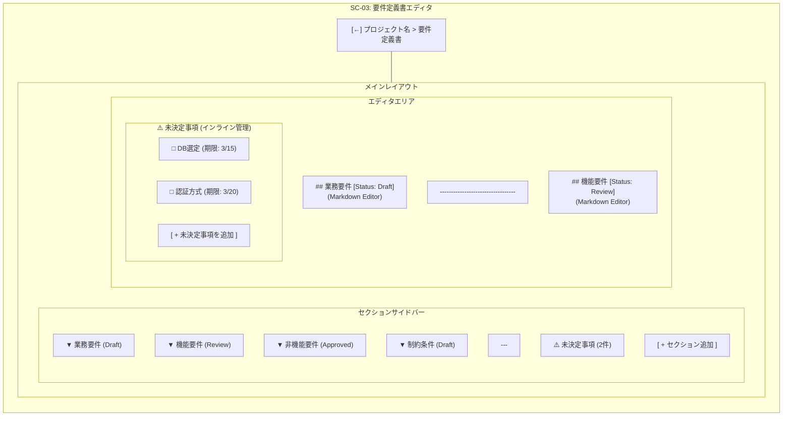
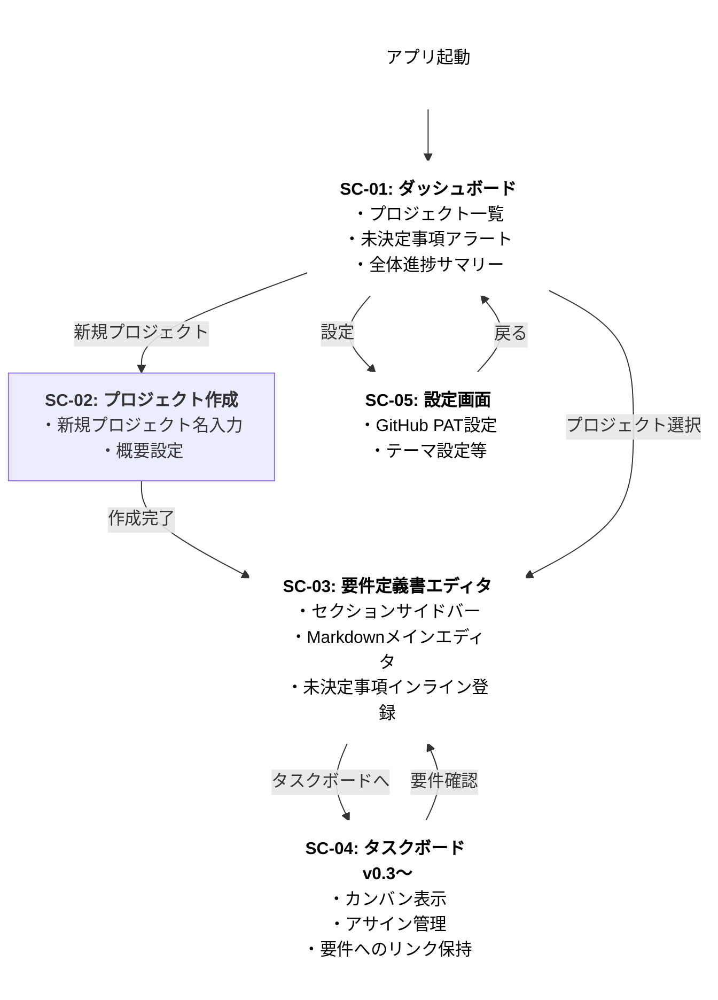

# DOC-17 業務用語定義

| 項目 | 内容 |
|------|------|
| 書類ID | DOC-17 |
| IPA分類 | DD.7.1 |
| プロジェクト名 | Reqflow |
| 作成日 | 2026-03-01 |
| 作成者 | Saku0512 |
| ステータス | Draft |

---

| 用語 | 定義 | 同義語・略語 | 対義語・注意 |
|------|------|-------------|-------------|
| **プロジェクト** | Reqflow上で管理する開発プロジェクトの単位。1つの要件定義書とタスクボードを持つ | — | GitHubのrepositoryとは別概念（連携先として設定する） |
| **要件定義書** | プロジェクトに1:1で紐付く、システムに何を作るかを定義した文書 | 要件書 | 仕様書（設計の詳細を書くもの）とは異なる |
| **セクション** | 要件定義書を構成する各章・区分。業務要件・機能要件・非機能要件・制約条件の4種が基本 | — | — |
| **セクションステータス** | セクションの承認状態。Draft → Review → Approved の3段階 | — | プロジェクト全体のステータスとは別に管理する |
| **未決定事項** | 要件定義書の作成中に判明した、まだ決まっていない事項。期限付きで管理する | Open Issue | GitHubのIssueとは別概念 |
| **タスク** | 実装・作業の単位。要件セクションから生成され、要件IDが紐付く | チケット | GitHub Issueと1:1で同期することもできる（オプション） |
| **トレーサビリティ** | 要件とタスクの対応関係を追跡できる状態。「このタスクはどの要件から来たか」が常に分かること | 追跡可能性 | — |
| **スタンドアロン動作** | GitHubと連携せずにReqflowの中核機能（要件定義書・タスク管理）を使える状態 | オフラインモード（ネット接続不要とは異なる） | GitHub連携機能は無効になる |
| **PdM** | プロダクトマネージャー。プロダクトの価値・売上最大化に集中する。スクラムのPOに近い役割 | プロダクトオーナー（PO） | PM（プロジェクトマネージャー）と混同しないこと |
| **PM** | プロジェクトマネージャー。プロジェクト計画の遂行と外部との調整を主に担う | — | PdMと混同しないこと |
| **TL** | テックリード。技術的な意思決定・アーキテクチャ設計を担う | — | — |
| **PL** | プロジェクトリーダー。チーム内部の状態管理を担い、PMへ状況を伝える | — | — |
| **PAT** | Personal Access Token。GitHub APIへのアクセスに使用する認証トークン | — | パスワードと同等の機密情報。OS Keychainで管理する |
| **Wails** | GoとWebフロントエンドを組み合わせてデスクトップアプリを開発するフレームワーク | — | Tauriの代替として採用（GoをファーストクラスでサポートするためWailsを選択） |
| **デバウンス** | 連続するイベント（キー入力等）の最後のみを処理する技術。自動保存の実装に使用 | — | — |

---
---

# DOC-19 システム化業務一覧

| 項目 | 内容 |
|------|------|
| 書類ID | DOC-19 |
| IPA分類 | DD.8.1 |
| プロジェクト名 | Reqflow |
| 作成日 | 2026-03-01 |
| 作成者 | Saku0512 |
| ステータス | Draft |

---

| # | 業務名 | 現状（As-Is） | Reqflowによるシステム化（To-Be） | 対応機能ID | フェーズ |
|---|--------|--------------|--------------------------------|------------|----------|
| 1 | プロジェクト作成・管理 | Notionのページ階層で管理（非定型） | Reqflow上でプロジェクトを作成・一覧管理 | F-01, F-02 | v0.1 |
| 2 | 要件定義書の作成 | Notionで自由記述（テンプレートなし） | IPAフレームのテンプレートでMarkdown編集 | F-03, F-04 | v0.1 |
| 3 | 要件のステータス管理 | コメント・色分けで属人的に管理 | セクションごとにDraft/Review/Approvedを設定 | F-05 | v0.1 |
| 4 | 自動保存 | Notionが自動保存（外部依存） | Reqflowが1秒以内にローカル保存 | F-06 | v0.1 |
| 5 | 未決定事項の管理 | コメント・付箋で埋もれる | 期限付きでインライン管理・アラート表示 | F-07, F-15 | v0.1/v0.3 |
| 6 | タスク起票 | 要件定義書を読んで手動でIssueを起票 | 機能要件からワンクリックでタスク生成 | F-09 | v0.2 |
| 7 | GitHub Issue連携 | 手動・バラバラ | Reqflowから自動生成・要件IDを自動タグ付け | F-08, F-09 | v0.2（オプション） |
| 8 | タスク進捗管理 | GitHubとNotionを行き来して確認 | Reqflow内のカンバンで一元管理 | F-11, F-12 | v0.3 |
| 9 | 進捗報告 | 口頭・Slackで手動報告 | ダッシュボードで承認状況・進捗率を可視化 | F-13 | v0.3 |
| 10 | 要件ドラフト生成 | ヒアリング後に手書き | Anthropic APIで下書き自動生成 | F-14 | v1.0 |

---
---

# DOC-20 画面一覧

| 項目 | 内容 |
|------|------|
| 書類ID | DOC-20 |
| IPA分類 | DD.8.2 |
| プロジェクト名 | Reqflow |
| 作成日 | 2026-03-01 |
| 作成者 | Saku0512 |
| ステータス | Draft |

---

| 画面ID | 画面名 | 概要 | 主な利用者 | フェーズ |
|--------|--------|------|-----------|----------|
| SC-01 | ダッシュボード | プロジェクト一覧・未決定事項アラート・進捗サマリーを表示するホーム画面 | PdM / PM / PL | v0.1（アラートはv0.3） |
| SC-02 | プロジェクト作成画面 | プロジェクト名・説明・GitHub連携情報（オプション）の入力フォーム | PdM | v0.1 |
| SC-03 | 要件定義書エディタ | 左サイドバー（セクション一覧）＋右メイン（Markdownエディタ）の2カラム構成 | PdM / TL | v0.1 |
| SC-04 | タスクボード | カンバン形式（todo/in_progress/done）のタスク管理画面 | PdM / PL / TL | v0.3 |
| SC-05 | 設定画面 | GitHub PAT入力・アプリ設定（テーマ・自動保存間隔等） | PdM | v0.2 |

### SC-03 要件定義書エディタ 構成詳細



---
---

# DOC-22 外部インターフェース一覧

| 項目 | 内容 |
|------|------|
| 書類ID | DOC-22 |
| IPA分類 | DD.8.4 |
| プロジェクト名 | Reqflow |
| 作成日 | 2026-03-01 |
| 作成者 | Saku0512 |
| ステータス | Draft |

---

| IF-ID | 連携先 | 種別 | エンドポイント | 認証方式 | 主な操作 | 必須/オプション | フェーズ |
|-------|--------|------|---------------|----------|---------|-----------------|----------|
| IF-01 | GitHub GraphQL API v4 | REST over HTTPS | `https://api.github.com/graphql` | Bearer Token (PAT) | Issue作成・Projects追加・ステータス更新・アサイン | オプション | v0.2 |
| IF-02 | OS Keychain | ローカルAPI | macOS: Keychain / Windows: Credential Manager | OS認証 | PATの読み書き・削除 | オプション（PAT使用時は必須） | v0.2 |
| IF-03 | Anthropic API | REST over HTTPS | `https://api.anthropic.com/v1/messages` | Bearer Token (API Key) | 要件定義書ドラフト生成 | オプション | v1.0 |

### IF-01 GitHub API 利用詳細

```graphql
# Issue作成
mutation CreateIssue($repoId: ID!, $title: String!, $body: String!) {
  createIssue(input: {repositoryId: $repoId, title: $title, body: $body}) {
    issue { id number url }
  }
}

# ProjectsV2 へのItem追加
mutation AddProjectItem($projectId: ID!, $contentId: ID!) {
  addProjectV2ItemById(input: {projectId: $projectId, contentId: $contentId}) {
    item { id }
  }
}
```

### エラーハンドリング方針

| シナリオ | 挙動 |
|----------|------|
| GitHub未設定 | GitHub連携機能のみ非表示。他機能は通常通り動作 |
| PAT期限切れ・権限不足 | エラーメッセージを表示し、設定画面へ誘導 |
| APIレート制限 | リトライ（exponential backoff）を実装 |
| オフライン | GitHub連携機能のみエラー。ローカル操作は継続可能 |

---
---

# DOC-23 エンティティ一覧

| 項目 | 内容 |
|------|------|
| 書類ID | DOC-23 |
| IPA分類 | DD.8.5 |
| プロジェクト名 | Reqflow |
| 作成日 | 2026-03-01 |
| 作成者 | Saku0512 |
| ステータス | Draft |

---

| エンティティID | エンティティ名 | 説明 | 主キー | 主な属性 |
|---------------|---------------|------|--------|---------|
| E-01 | projects | プロジェクトの基本情報 | id (TEXT/UUID) | name, status, github_repo（nullable） |
| E-02 | requirement_docs | 要件定義書本体（プロジェクトに1:1） | id (TEXT/UUID) | project_id, updated_at |
| E-03 | requirement_sections | 要件定義書の各セクション | id (TEXT/UUID) | doc_id, type, title, content, order_index, status |
| E-04 | open_issues | 未決定事項 | id (TEXT/UUID) | doc_id, description, due_date, resolved |
| E-05 | tasks | タスク（要件セクションと紐付く） | id (TEXT/UUID) | project_id, section_id（nullable）, github_issue_id（nullable）, title, status, assignee |

---
---

# DOC-26 画面遷移図

| 項目 | 内容 |
|------|------|
| 書類ID | DOC-26 |
| IPA分類 | DD.9.3 |
| プロジェクト名 | Reqflow |
| 作成日 | 2026-03-01 |
| 作成者 | Saku0512 |
| ステータス | Draft |

---



---
---

# DOC-29 エンティティ定義書

| 項目 | 内容 |
|------|------|
| 書類ID | DOC-29 |
| IPA分類 | DD.10.1 |
| プロジェクト名 | Reqflow |
| 作成日 | 2026-03-01 |
| 作成者 | Saku0512 |
| ステータス | Draft |

---

### E-01: projects

| カラム名 | 型 | NULL | デフォルト | 制約 | 説明 |
|---------|-----|------|-----------|------|------|
| id | TEXT | NOT NULL | — | PK | UUID v4 |
| name | TEXT | NOT NULL | — | — | プロジェクト名（1〜100文字） |
| description | TEXT | NULL | — | — | プロジェクト概要 |
| status | TEXT | NOT NULL | 'draft' | CHECK | draft / active / archived |
| github_repo | TEXT | NULL | — | — | `owner/repo` 形式。未連携時はNULL |
| github_project_id | TEXT | NULL | — | — | GitHub Projects ID。未連携時はNULL |
| created_at | DATETIME | NOT NULL | CURRENT_TIMESTAMP | — | 作成日時 |
| updated_at | DATETIME | NOT NULL | CURRENT_TIMESTAMP | — | 更新日時 |

### E-02: requirement_docs

| カラム名 | 型 | NULL | デフォルト | 制約 | 説明 |
|---------|-----|------|-----------|------|------|
| id | TEXT | NOT NULL | — | PK | UUID v4 |
| project_id | TEXT | NOT NULL | — | FK→projects.id | 紐付くプロジェクト |
| updated_at | DATETIME | NOT NULL | CURRENT_TIMESTAMP | — | 更新日時 |

### E-03: requirement_sections

| カラム名 | 型 | NULL | デフォルト | 制約 | 説明 |
|---------|-----|------|-----------|------|------|
| id | TEXT | NOT NULL | — | PK | UUID v4 |
| doc_id | TEXT | NOT NULL | — | FK→requirement_docs.id | 紐付く要件定義書 |
| type | TEXT | NOT NULL | — | CHECK | business / functional / non_functional / constraint |
| title | TEXT | NOT NULL | — | — | セクションタイトル（1〜200文字） |
| content | TEXT | NULL | — | — | Markdown本文 |
| order_index | INTEGER | NOT NULL | 0 | — | 表示順（0始まり） |
| status | TEXT | NOT NULL | 'draft' | CHECK | draft / review / approved |

### E-04: open_issues

| カラム名 | 型 | NULL | デフォルト | 制約 | 説明 |
|---------|-----|------|-----------|------|------|
| id | TEXT | NOT NULL | — | PK | UUID v4 |
| doc_id | TEXT | NOT NULL | — | FK→requirement_docs.id | 紐付く要件定義書 |
| description | TEXT | NOT NULL | — | — | 未決定事項の内容（1〜500文字） |
| due_date | DATE | NULL | — | — | 解決期限（NULL可） |
| resolved | INTEGER | NOT NULL | 0 | CHECK (0 or 1) | 0=未解決 / 1=解決済み |
| created_at | DATETIME | NOT NULL | CURRENT_TIMESTAMP | — | 登録日時 |

### E-05: tasks

| カラム名 | 型 | NULL | デフォルト | 制約 | 説明 |
|---------|-----|------|-----------|------|------|
| id | TEXT | NOT NULL | — | PK | UUID v4 |
| project_id | TEXT | NOT NULL | — | FK→projects.id | 紐付くプロジェクト |
| section_id | TEXT | NULL | — | FK→requirement_sections.id | 紐付く要件セクション（NULL=手動作成） |
| github_issue_id | TEXT | NULL | — | — | GitHub Issue ID（未連携時はNULL） |
| title | TEXT | NOT NULL | — | — | タスクタイトル（1〜200文字） |
| status | TEXT | NOT NULL | 'todo' | CHECK | todo / in_progress / done |
| assignee | TEXT | NULL | — | — | 担当者名 or GitHubユーザー名 |
| due_date | DATE | NULL | — | — | 期限 |
| created_at | DATETIME | NOT NULL | CURRENT_TIMESTAMP | — | 作成日時 |
| updated_at | DATETIME | NOT NULL | CURRENT_TIMESTAMP | — | 更新日時 |

---
---

# DOC-31 コード体系定義書

| 項目 | 内容 |
|------|------|
| 書類ID | DOC-31 |
| IPA分類 | DD.10.3 |
| プロジェクト名 | Reqflow |
| 作成日 | 2026-03-01 |
| 作成者 | Saku0512 |
| ステータス | Draft |

---

### プロジェクトステータス（projects.status）

| コード値 | 表示名 | 説明 |
|---------|--------|------|
| `draft` | 下書き | 要件定義中。デフォルト値 |
| `active` | 進行中 | 開発フェーズに入っている |
| `archived` | アーカイブ | 完了・停止したプロジェクト |

### セクション種別（requirement_sections.type）

| コード値 | 表示名 | IPAでの対応 |
|---------|--------|------------|
| `business` | 業務要件 | ビジネス要求定義（BR） |
| `functional` | 機能要件 | システム化要求定義（SR）- 機能 |
| `non_functional` | 非機能要件 | システム化要求定義（SR）- 非機能 |
| `constraint` | 制約条件 | 開発上の制約 |

### セクションステータス（requirement_sections.status）

| コード値 | 表示名 | 説明 | 表示色（UI参考） |
|---------|--------|------|----------------|
| `draft` | Draft | 作成中。レビュー前 | グレー |
| `review` | Review | レビュー依頼中 | 黄色 |
| `approved` | Approved | 承認済み | 緑 |

### タスクステータス（tasks.status）

| コード値 | 表示名 | カンバン列 | 説明 |
|---------|--------|-----------|------|
| `todo` | Todo | 左列 | 未着手 |
| `in_progress` | In Progress | 中央列 | 作業中 |
| `done` | Done | 右列 | 完了 |

---
---

# DOC-33 非機能要件書

| 項目 | 内容 |
|------|------|
| 書類ID | DOC-33 |
| IPA分類 | DD.12.1 |
| 参考規格 | IPA 非機能要求グレード2018 |
| プロジェクト名 | Reqflow |
| 作成日 | 2026-03-01 |
| 作成者 | Saku0512 |
| ステータス | Draft |

---

## 1. 可用性

| 項目 | 要件 | 補足 |
|------|------|------|
| 対応OS | macOS 13以上、Windows 10以上 | Wailsのサポート範囲に準拠 |
| オフライン動作 | 要件定義書の作成・編集・タスク管理はオフラインで動作する | GitHub連携機能を除く |
| クラッシュ時のデータ保全 | デバウンス自動保存により、停止直前の編集内容を保全する | データロスなし |
| バックアップ | SQLiteファイルをユーザーが任意の場所にコピーできる | 自動バックアップはv1.0以降で検討 |

## 2. 性能・拡張性

| 項目 | 要件 | 補足 |
|------|------|------|
| アプリ起動時間 | 3秒以内 | コールドスタート |
| 自動保存レスポンス | 編集停止から1秒以内に保存完了 | デバウンス間隔: 800ms |
| 対応プロジェクト数 | 100プロジェクト以上 | SQLiteの容量制限内（数GB） |
| セクション数 | 1プロジェクトあたり50セクション以上 | — |
| Markdown編集レスポンス | キー入力から表示更新まで100ms以内 | エディタのリアルタイムレンダリング |

## 3. セキュリティ

| 項目 | 要件 | 補足 |
|------|------|------|
| GitHub PAT の保管 | OS Keychain（macOS）/ Credential Manager（Windows）に暗号化して保存 | DBへの平文保存は禁止 |
| Anthropic API Key の保管 | 同上（OS Keychain） | v1.0実装時 |
| ローカルDBの保護 | SQLiteファイルへのアクセスはアプリ経由のみ（直接操作を想定した機能は提供しない） | — |
| 通信 | GitHub API・Anthropic APIとの通信はHTTPSのみ | HTTP通信は行わない |
| 機密情報のログ出力禁止 | PATやAPIキーをログに出力しない | — |

## 4. 運用・保守性

| 項目 | 要件 | 補足 |
|------|------|------|
| DBマイグレーション | スキーマ変更はマイグレーションファイルで管理し、アプリ起動時に自動適用する | golang-migrateを使用予定 |
| エラーログ | エラーログをローカルファイルに出力する | ローテーション: 30日 |
| ログレベル | DEBUG / INFO / WARN / ERROR の4段階 | リリース版はINFO以上 |
| アップデート | Wailsのビルド成果物を差し替えてアップデートする | 自動アップデートはv1.0以降で検討 |

## 5. 移行性

| 項目 | 要件 | 補足 |
|------|------|------|
| 初期リリース | 既存データからの移行要件なし | — |
| 将来対応 | NotionやConfluenceからのインポート機能を検討（v1.0以降） | 未決定事項U-04 |
| データポータビリティ | SQLiteファイルをエクスポート・インポートできる | ユーザーが自分でファイルをコピーすることでバックアップ・移行可能 |

## 6. システム環境

| 項目 | 要件 | 補足 |
|------|------|------|
| 配布形式 | 各OS向けの実行ファイル（.app / .exe） | Wails buildで生成 |
| インストール | インストーラー不要（ドラッグ&ドロップまたはzip展開） | v0.1はシンプルな配布を優先 |
| 依存ライブラリ | ランタイム依存なし（シングルバイナリ） | Wailsの特性 |